# Phase 75D.6R Visual Review

Three isolated design directions for PDF → Word, prototyped for human review.
Production tool remains on the 75D.5 baseline — nothing here is live.

Review sites live at `/design-lab/pdf-to-word/{a,b,c}` (state switcher + dark mode).

## Concept A — The Atelier

Layered worktop, dimensional file plate, *Layered Document Morph* processing visual.

- Desktop Empty

  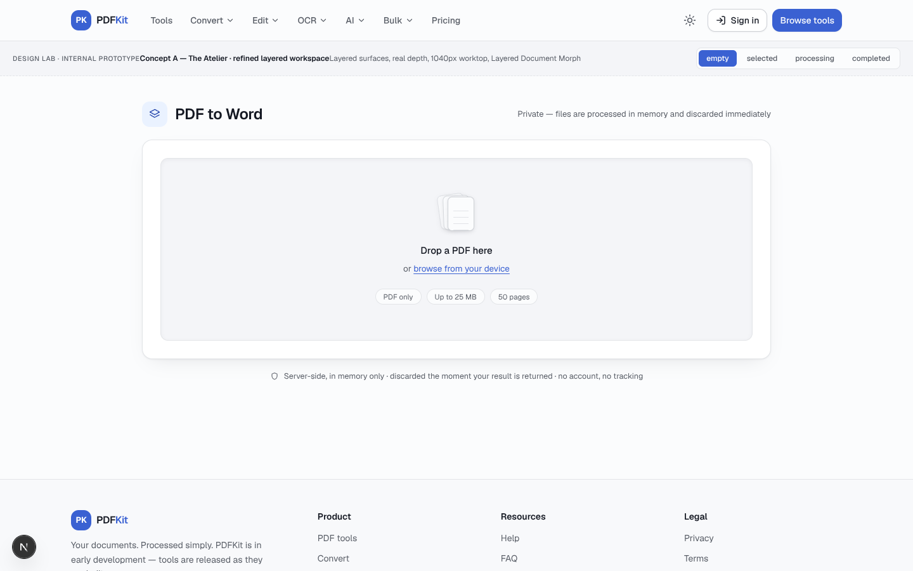
- Desktop Selected

  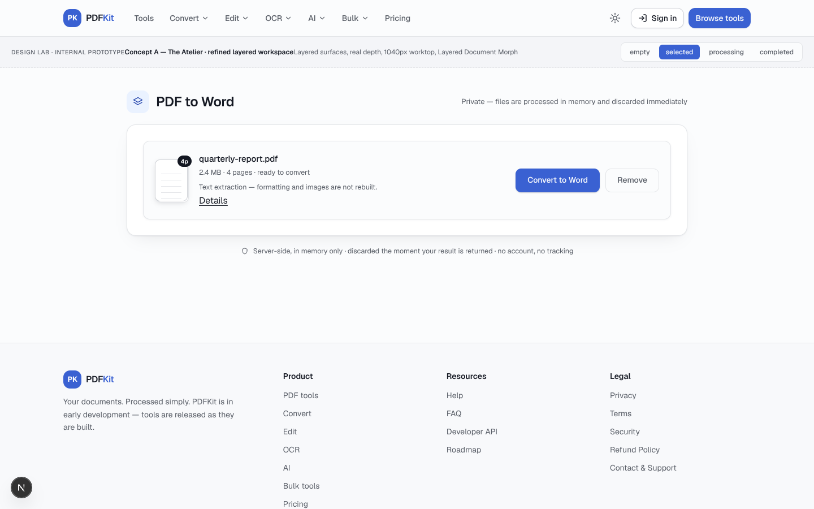
- Desktop Processing

  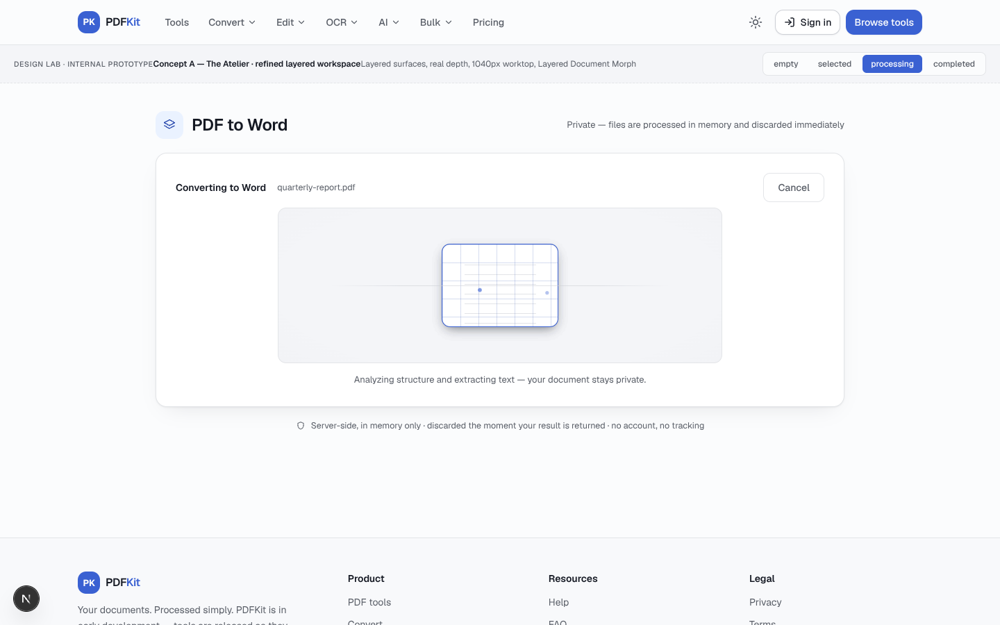
- Desktop Completed

  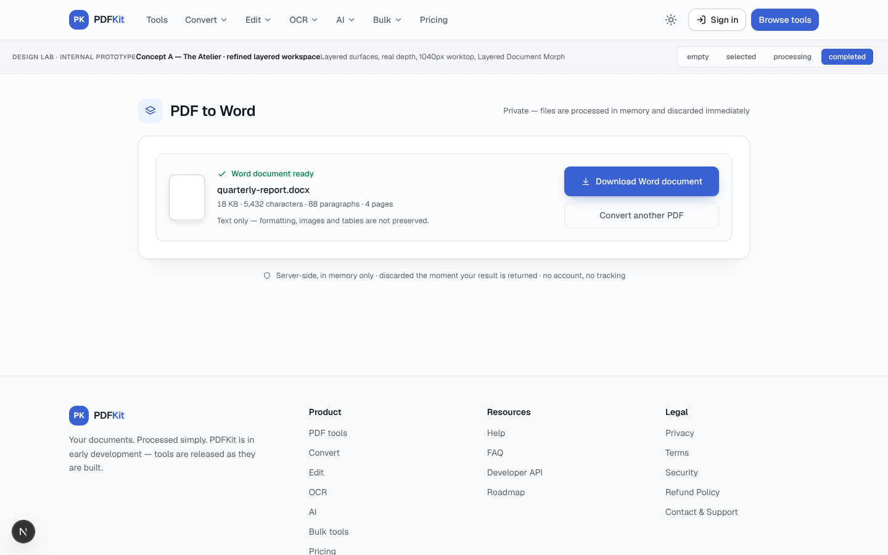
- Desktop Processing Dark

  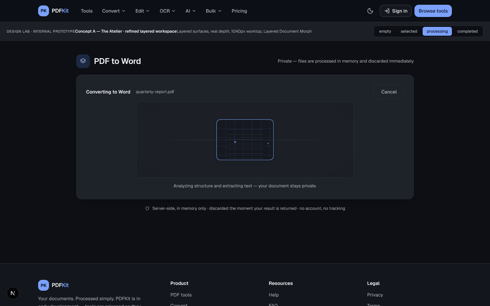
- Mobile Processing

  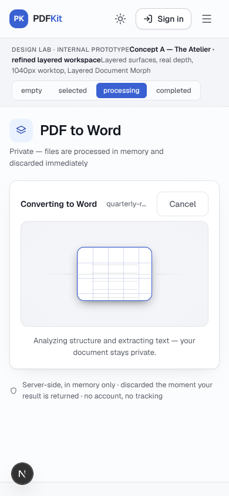

## Concept B — Signal Studio

Ambient panel, concentric-ring target, *Structured Signal Transformation* processing visual (offset-path fragments, arrival-synced output grid).

- Desktop Empty

  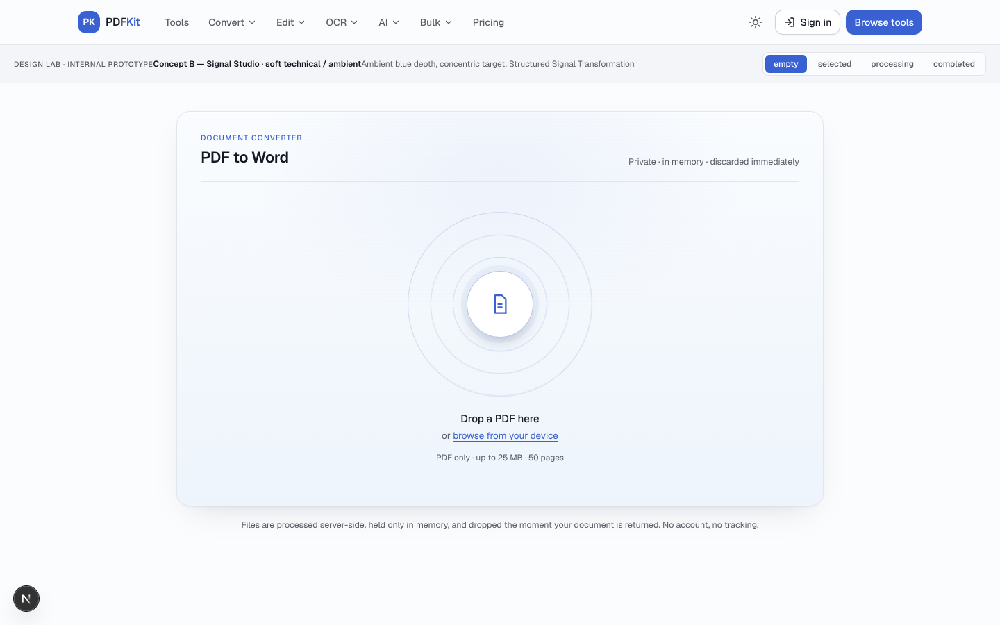
- Desktop Selected

  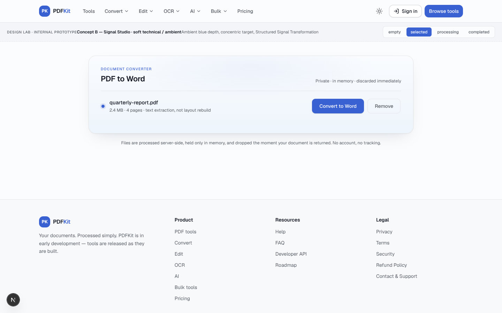
- Desktop Processing

  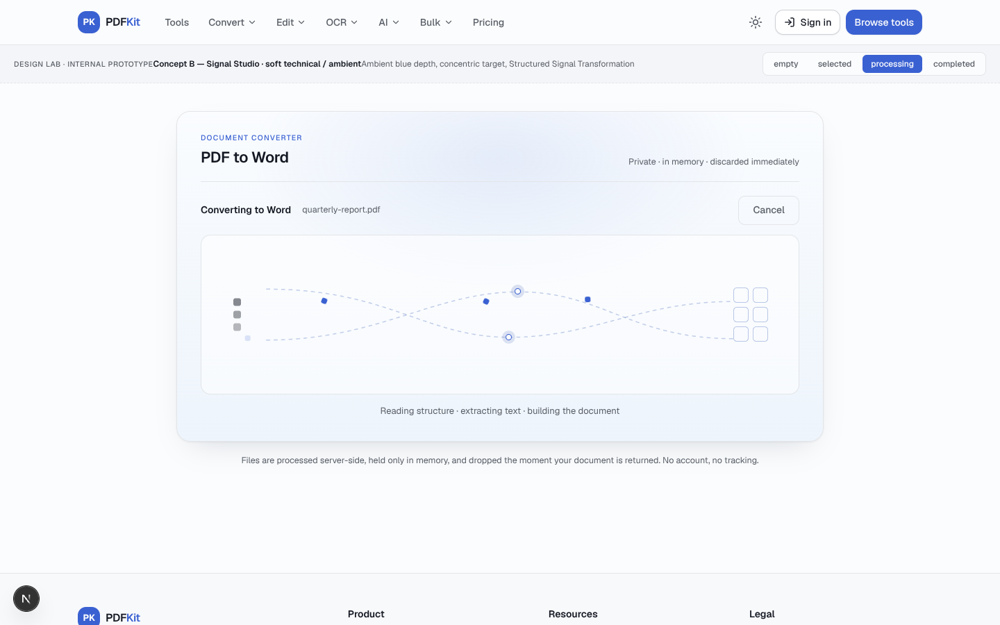
- Desktop Completed

  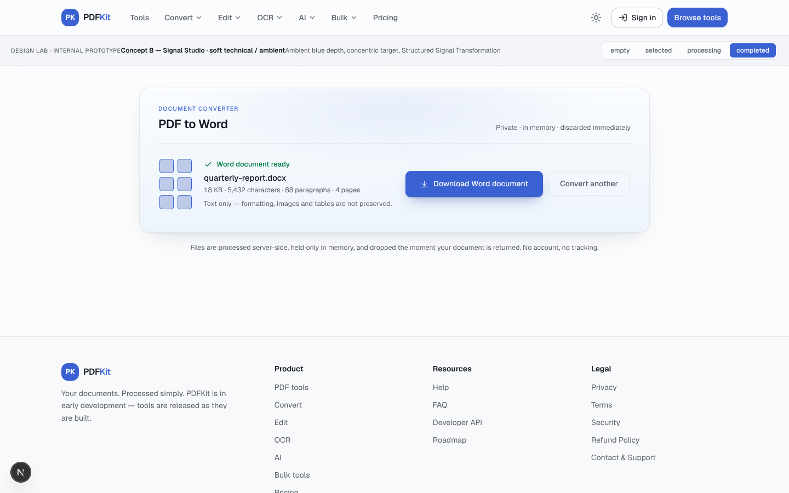
- Desktop Processing Dark

  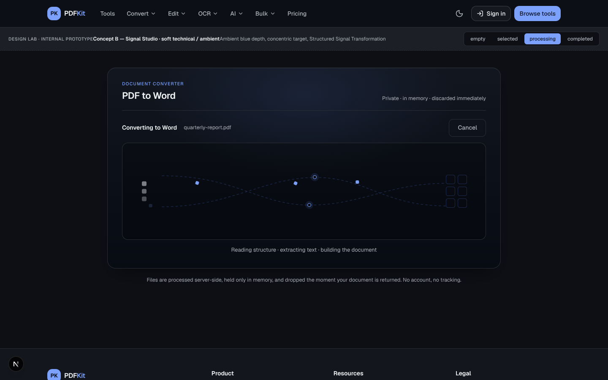
- Mobile Processing

  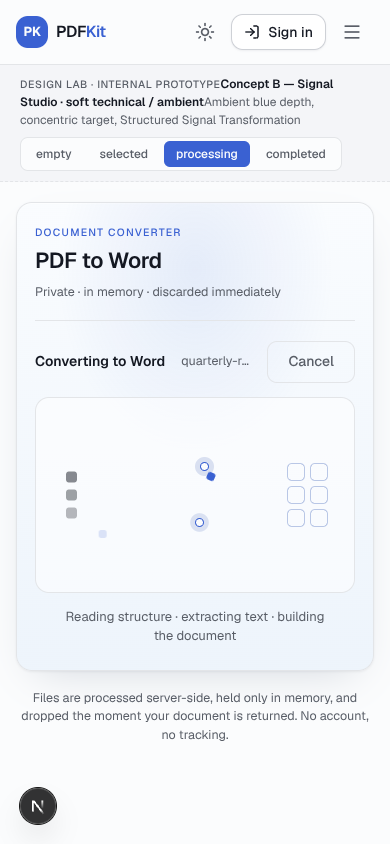

## Concept C — The Press

Editorial rail + spatial tray stage, *Dimensional Transformation* processing visual (3D card flip + orbiting fragments).

- Desktop Empty

  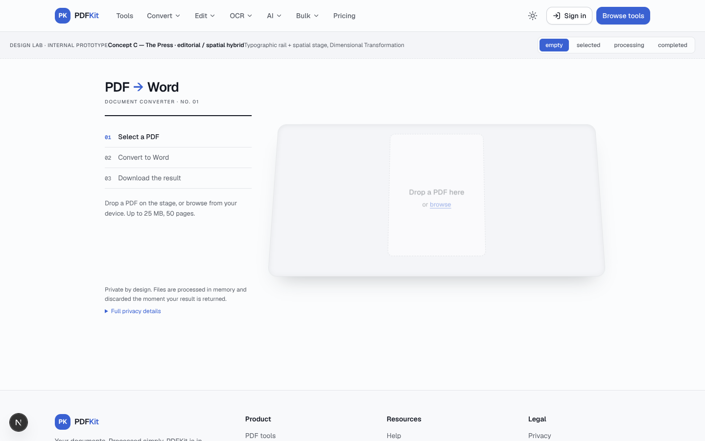
- Desktop Selected

  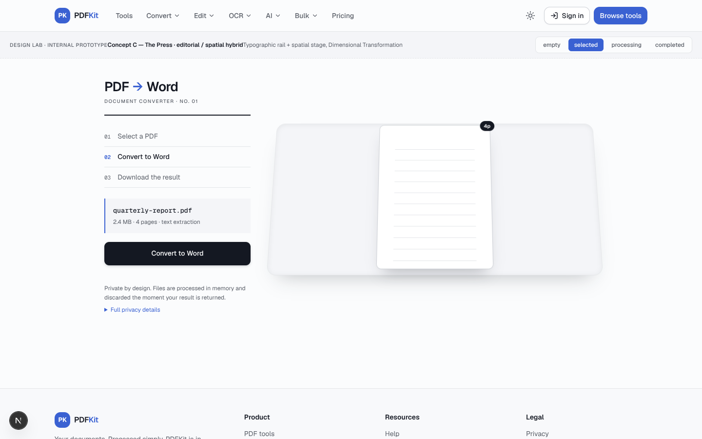
- Desktop Processing

  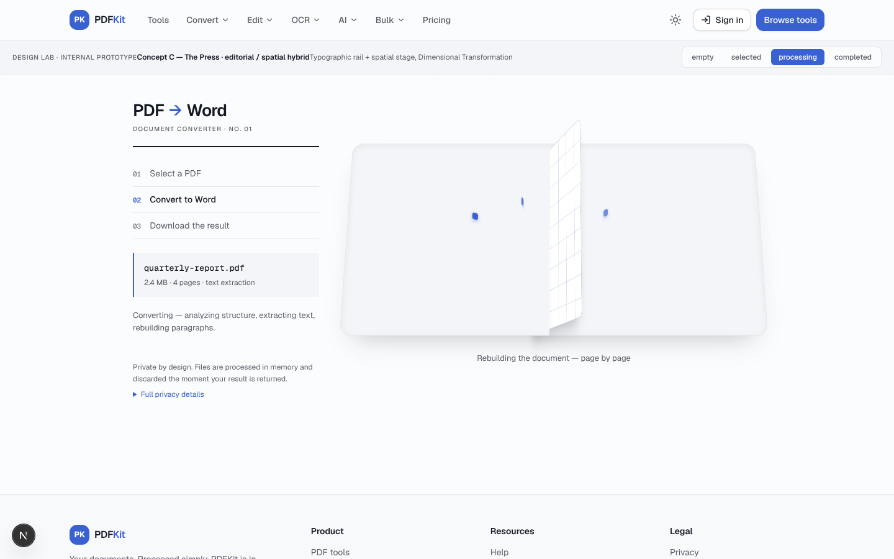
- Desktop Completed

  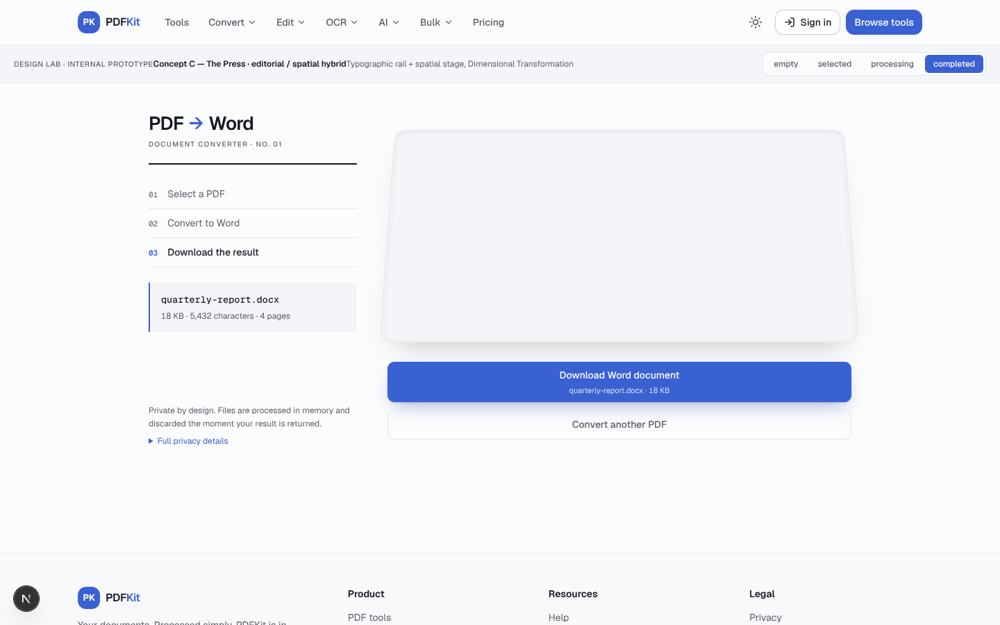
- Desktop Processing Dark

  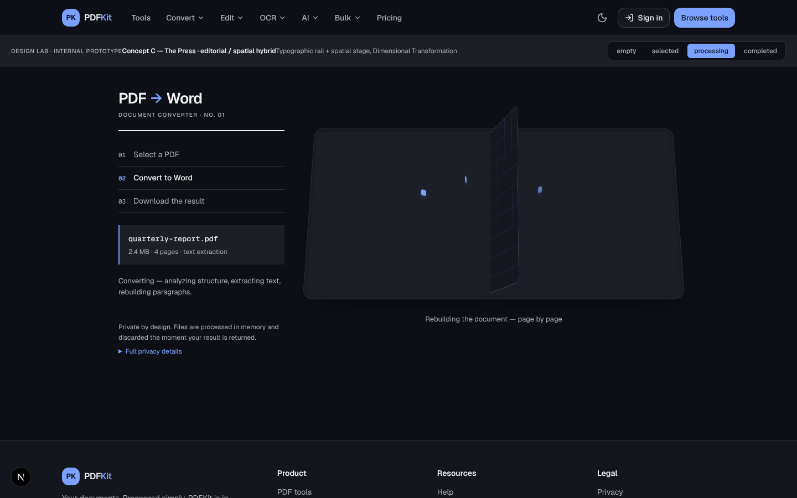
- Mobile Processing

  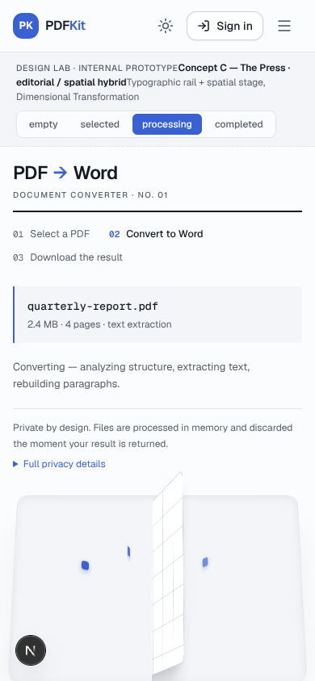

---

Full analysis: [`design/DESIGN-REVIEW-75D6R.md`](../../DESIGN-REVIEW-75D6R.md) (scores, strengths/weaknesses/risks, recommendation).

Desktop shots: 1440×900 · Mobile shots: 390×844 · All states mocked in the design lab; no production code involved.
