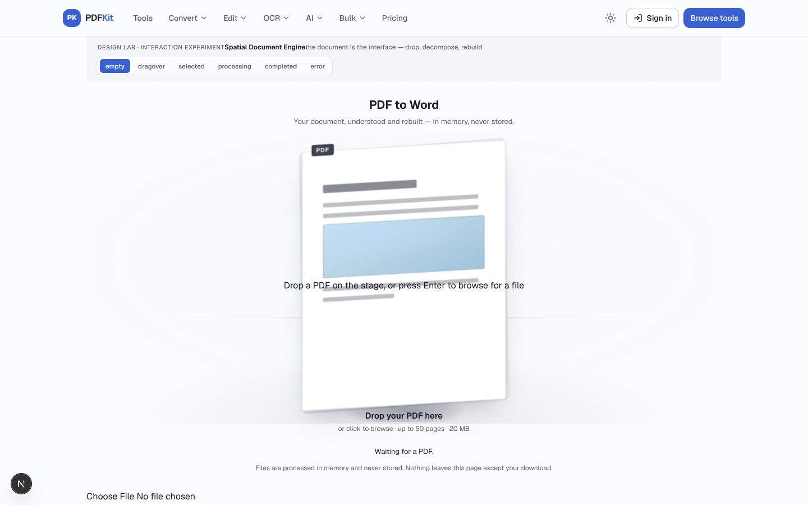
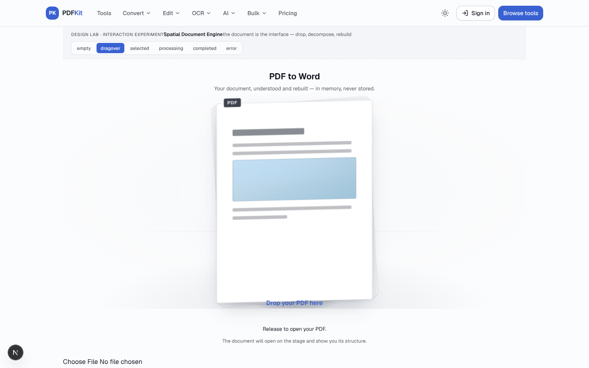
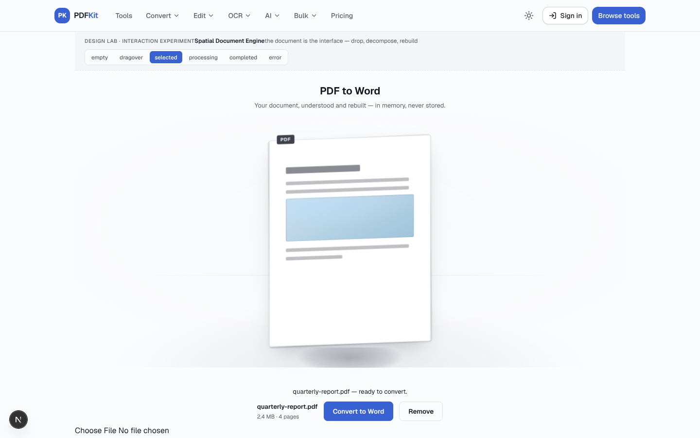
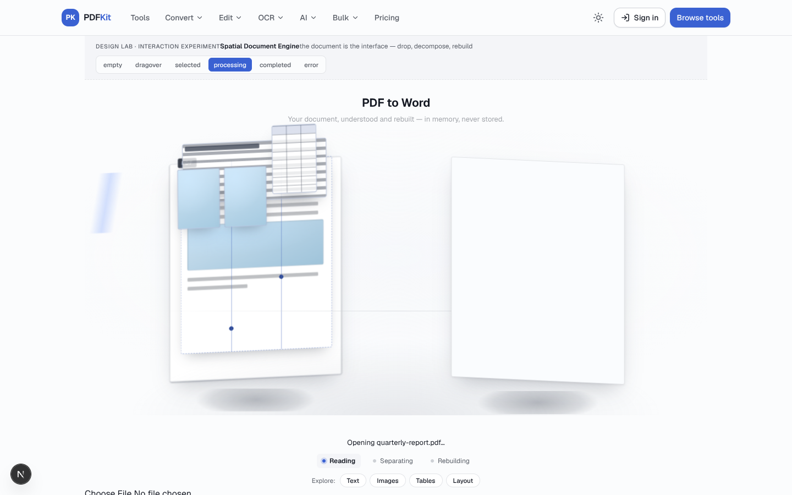
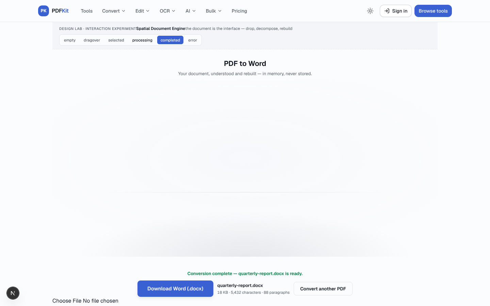
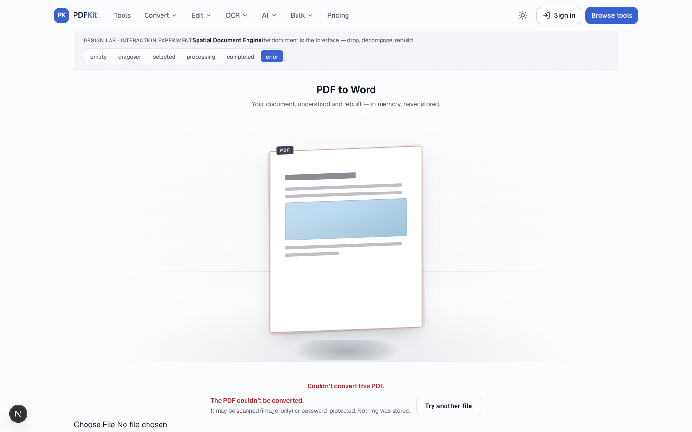
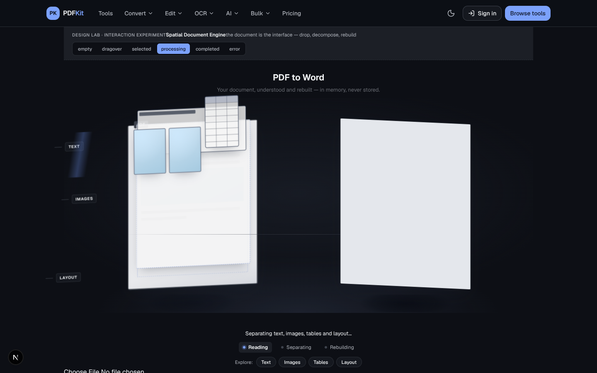
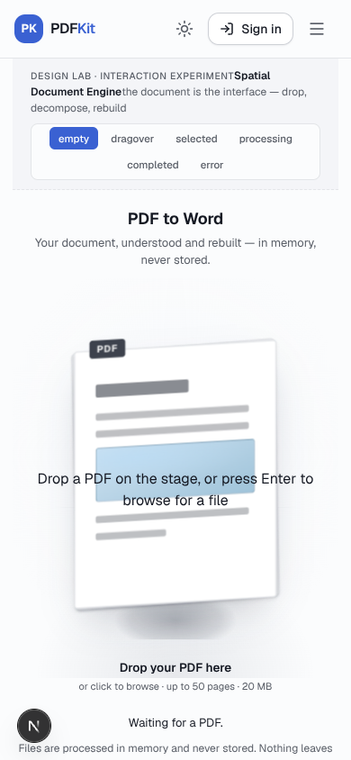
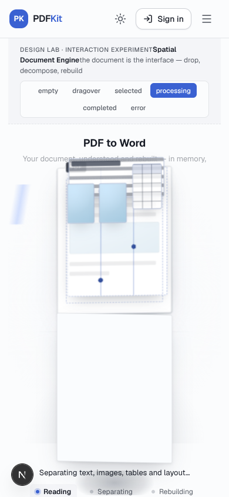
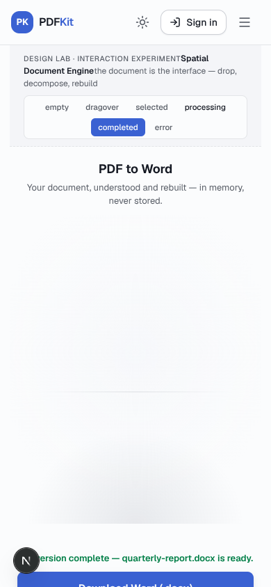

# Phase 75D.7 — Spatial Document Engine: Visual Review

Isolated design-lab experiment at `/design-lab/pdf-to-word/spatial`.
Production PDF → Word remains the 75D.5 baseline — nothing here is live.

The central idea: **the document itself becomes the interface.** One persistent
PDF object owns the stage — it responds to the pointer, attracts dragged files,
decomposes into its real structures (text / images / tables / layout), and those
structures travel and rebuild as a Word document that settles and offers itself
for download.

## Desktop 1440×900 — Empty

The staged PDF object with layered page depth and a barely-there tonal field.

## Desktop — Drag-over

The document magnetizes toward the drag point; pages fan open, surface illuminates.

## Desktop — Selected

The document at rest with its file plate, Convert and Remove actions.

## Desktop — Processing, early (~1s)

The stage widens: PDF takes the left position, a blank Word surface fades in on the right.

## Desktop — Processing, decomposition (~2s)

An elegant exploded technical drawing: text, images, tables and layout lift out
in 3D with technical-drawing captions and counts.

## Desktop — Processing, reconstruction (~5s)

Structures travel to the Word document; text flows into paragraphs, images place
into frames, the table rebuilds as cells.

## Desktop — Completed

The Word document recenters (~0.7s transition), the PDF recedes, Download becomes primary.

## Desktop — Error

The document settles back; an inline, document-centered explanation — no red banner.

## Desktop — Processing, dark mode

Paper-light documents on the dark stage; the forming Word surface carries a faint cool tint.

## Mobile 390×844 — Empty

First-class vertical composition: flatter perspective, on-plane labels.

## Mobile — Processing

PDF top, Word forming below — decomposition and rebuild in one column.

## Mobile — Completed

Full-width Download action with result meta.

---

Research + technology decision: [`design/DESIGN-RESEARCH-75D7.md`](../../DESIGN-RESEARCH-75D7.md) ·
Prior directions: [`design/verification/75D6R/`](../75D6R/README.md)

All states mocked in the design lab (state switcher on the page); no production
code, conversion logic, or APIs involved.
