# Phase 75D.8 — Document Transformation Worlds: Visual Review

Three isolated visual R&D studies exploring an original, interactive visual
language for PDFKit. **Art direction only** — no workflow, no API, no
production changes. 75D.5 remains the production baseline; A/B/C (75D.6R) and
the Spatial Document Engine (75D.7) stay archived.

The core principle under test: **the viewport is the transformation space** —
the environment participates, and the document is treated as structured
information, not office paper. Each study is a deterministic four-beat
composition (START / MID / RECONSTRUCT / COMPLETE); every screenshot below was
verified to match its named state before capture.

## World 1 — Information Glass
`/design-lab/transformation/information-glass`
The document as layered translucent information surfaces. Four glass plates —
Layout, Text, Images, Tables — read by looking *through* each other, separate
in depth, pass through a lens-curtain transformation field (bent light,
prismatic edge, displaced environmental rules), and resolve into one Word pane.

- Desktop Start

  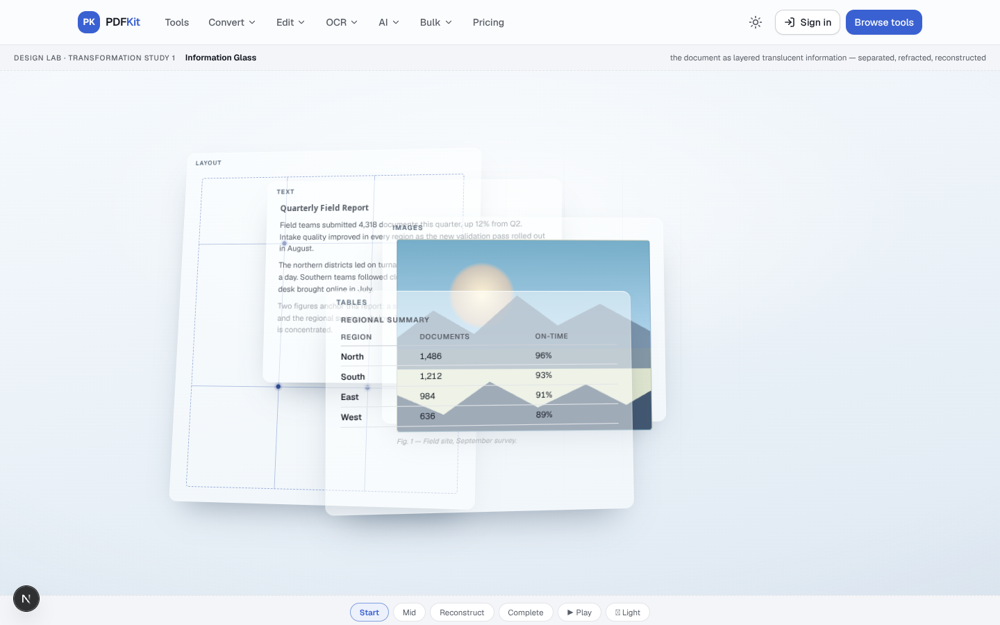
- Desktop Mid (plates refracting through the lens field)

  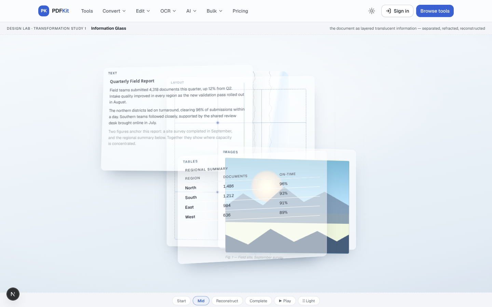
- Desktop Reconstruction (plates converging, Word pane emerging)

  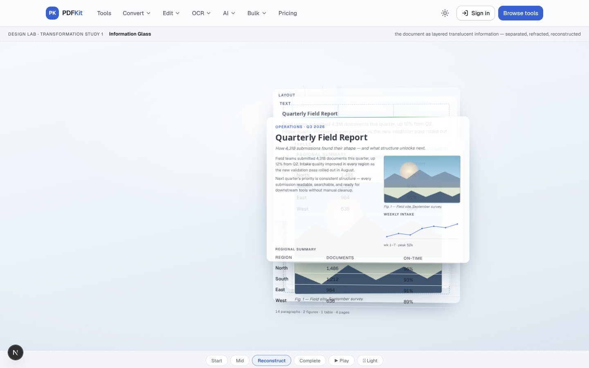
- Desktop Complete (the resolved Word pane is the hero)

  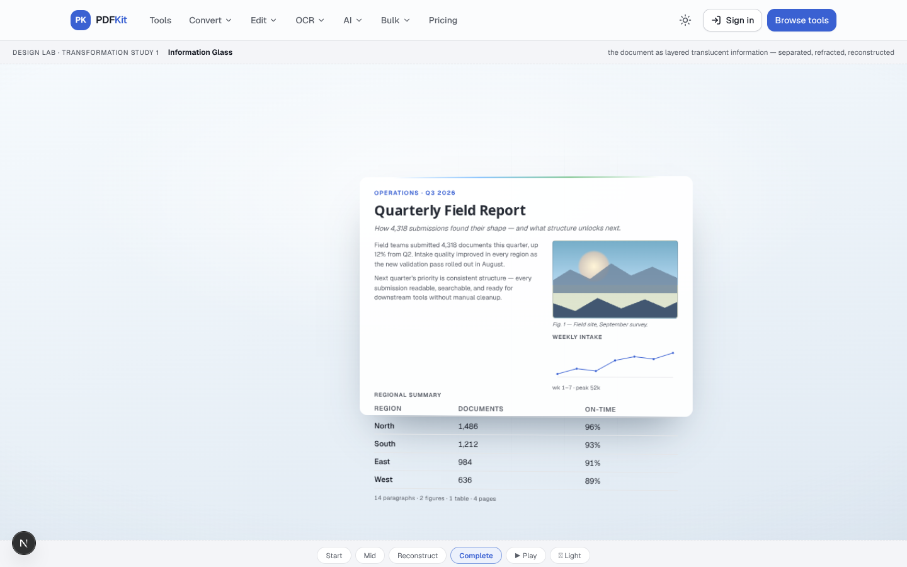
- Desktop Dark Mid

  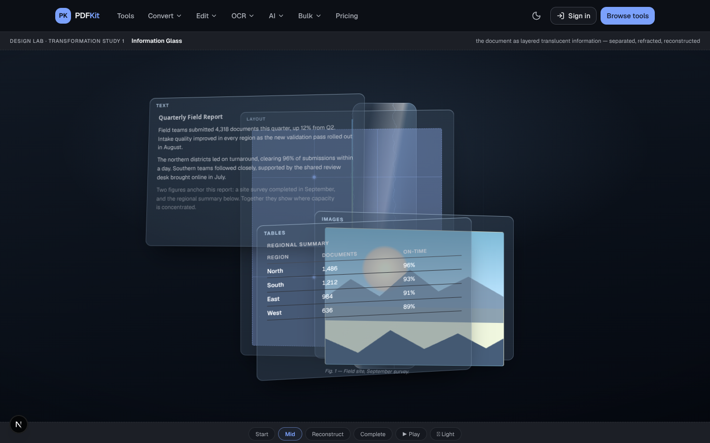
- Mobile Mid (390×844, scaled composition)

  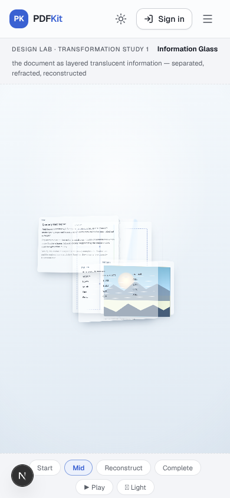

## World 2 — Spatial Typography
`/design-lab/transformation/spatial-type`
The document IS typography in space. A dense editorial composition (serif
display, real paragraphs, rules-only table, thin chart, quiet figure) whose
transformation is a change of ALIGNMENT SYSTEM: old baselines dim, a new
primary-tinted grid appears, units separate, the table unfolds row by row —
then everything locks into a resolved document under a drawn title rule. A
giant environmental pilcrow (¶) ghosts the background.

- Desktop Start

  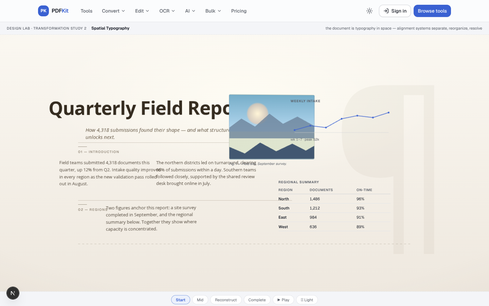
- Desktop Mid (new grid appearing, units separating, table unfolding)

  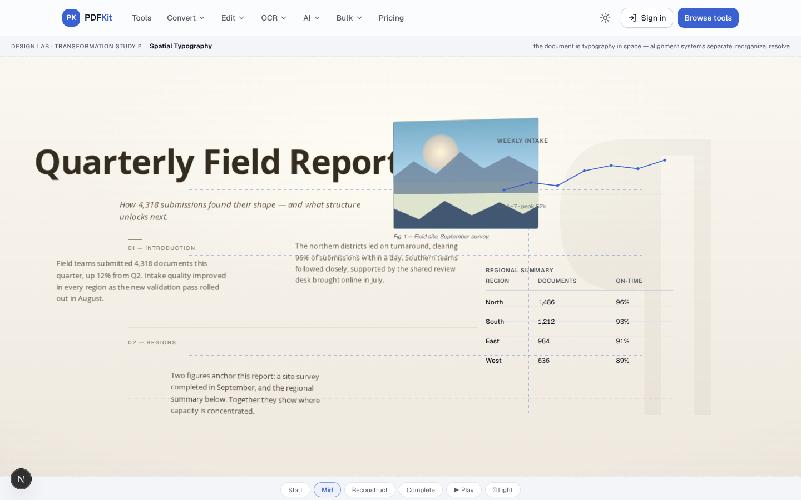
- Desktop Reconstruction (units flowing to the new grid)

  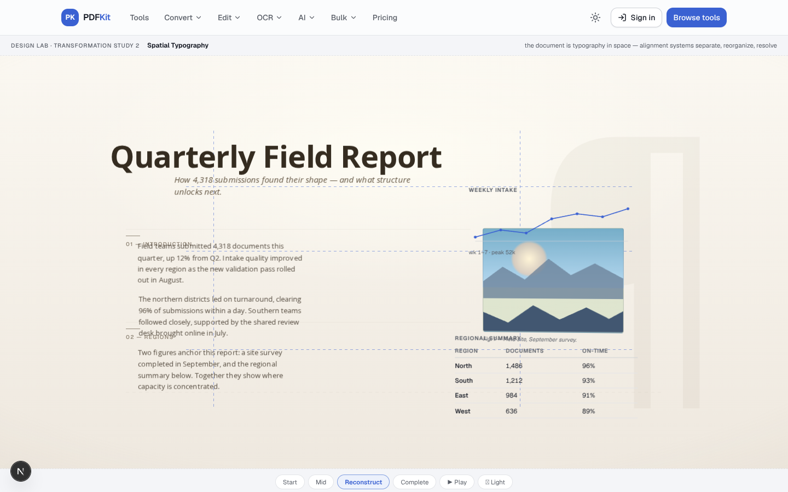
- Desktop Complete (resolved document, title rule drawn)

  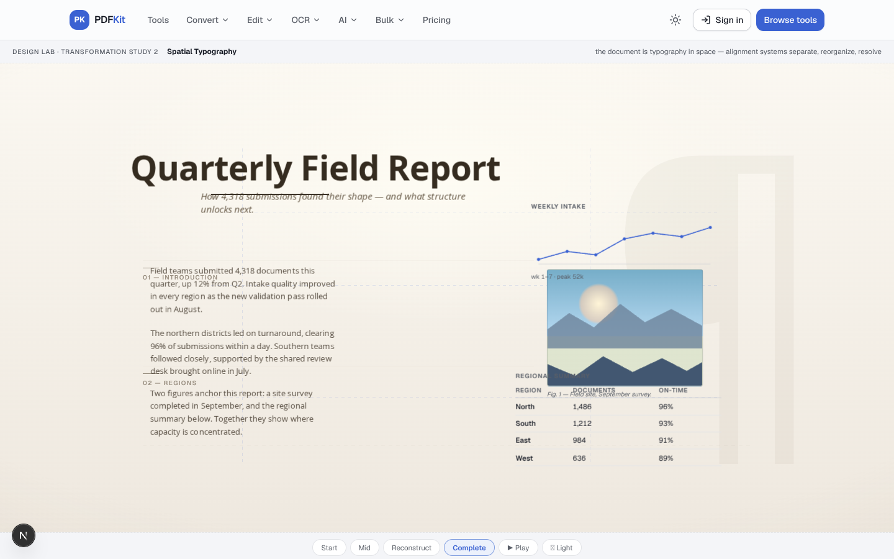
- Desktop Dark Mid

  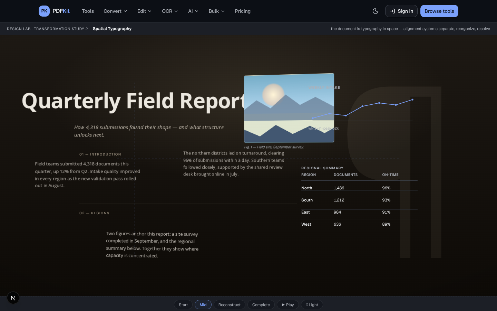
- Mobile Mid (390×844, scaled composition)

  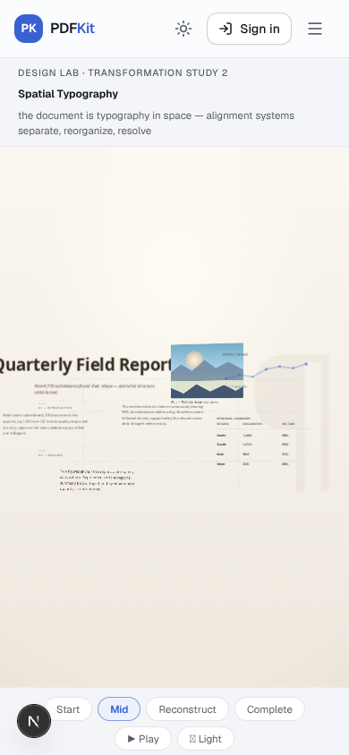

## World 3 — Document Matter
`/design-lab/transformation/document-matter`
The document as structured digital matter: 43 authored fragments (heading
chips, paragraph strips with real text, six tiles that are slices of one
photograph, table cells with real values, page frames, layout anchors)
assemble as a document-shaped mass, release along three streamlines through a
volumetric light column, and dock into a forming Word structure — the camera
settling closer as it completes.

- Desktop Start (the source mass)

  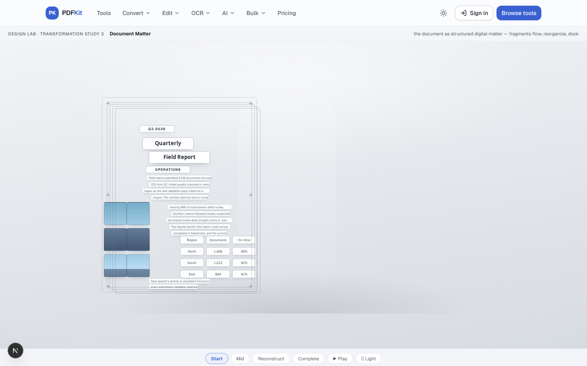
- Desktop Mid (fragments in flight along streamlines)

  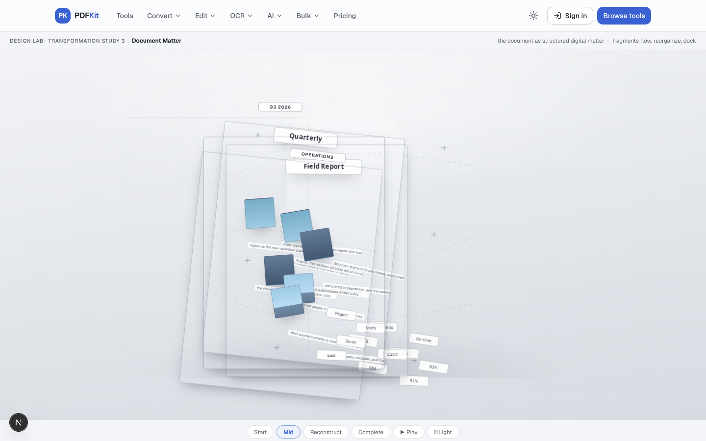
- Desktop Reconstruction (fragments docking into rows, grid and figure)

  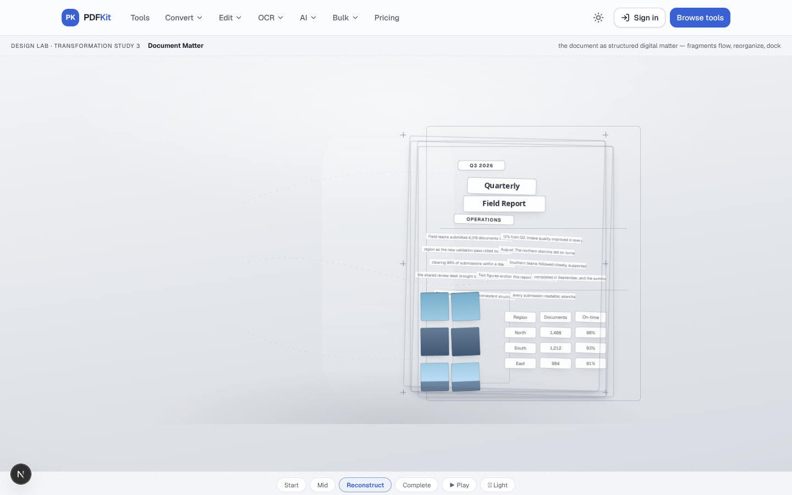
- Desktop Complete (resolved document, camera settled in)

  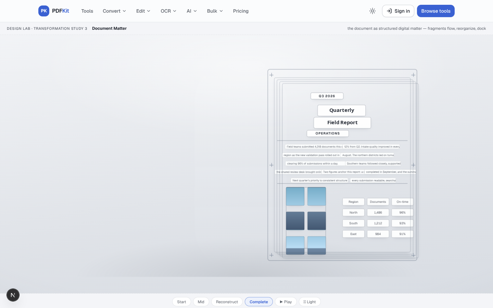
- Desktop Dark Mid

  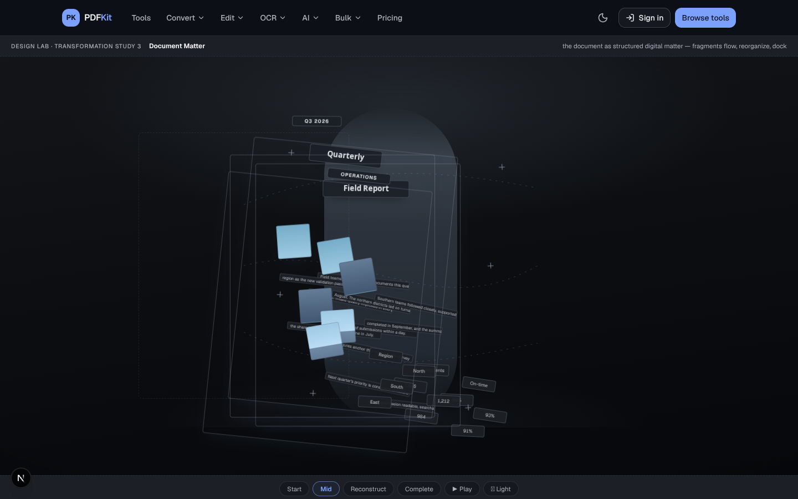
- Mobile Mid (390×844, scaled composition)

  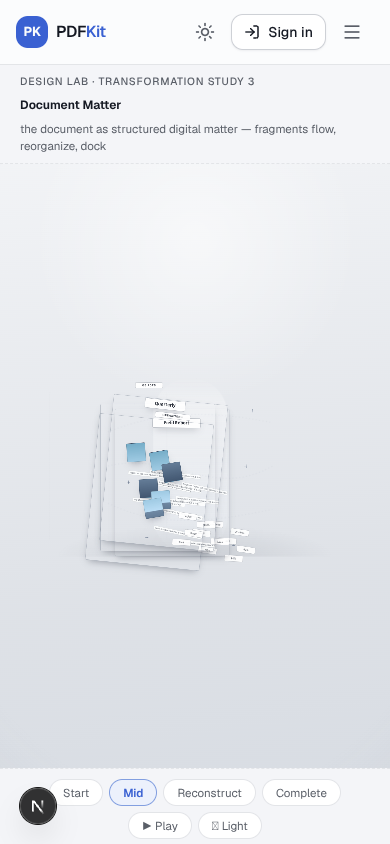

---

Research, technology decisions and per-world scores:
[`design/DESIGN-RESEARCH-75D8.md`](../../DESIGN-RESEARCH-75D8.md) ·
Prior directions: [`75D6R/`](../75D6R/README.md) · [`75D7/`](../75D7/README.md)

All beats are mocked in the design lab (START / MID / RECONSTRUCT / COMPLETE /
PLAY controls on each page); no production code, conversion logic, or APIs
involved. Desktop 1440×900 · Mobile 390×844.
